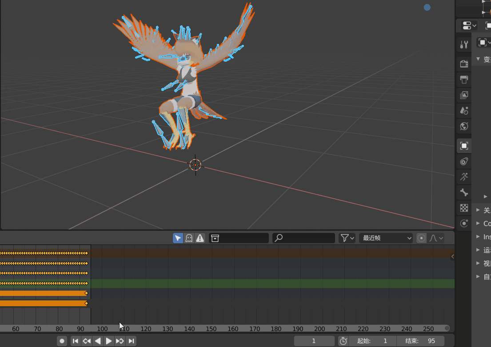
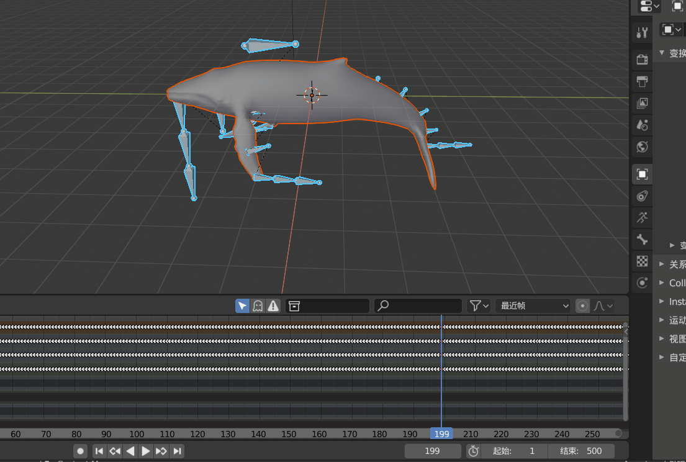
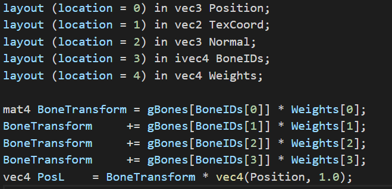
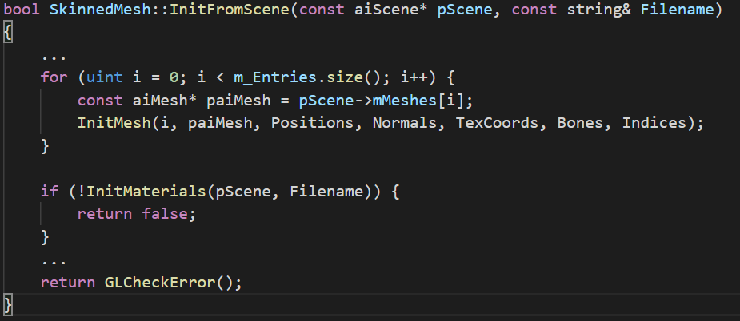
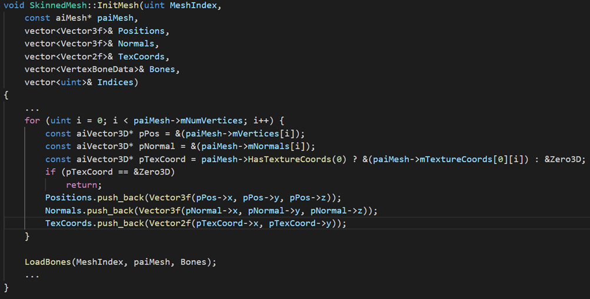
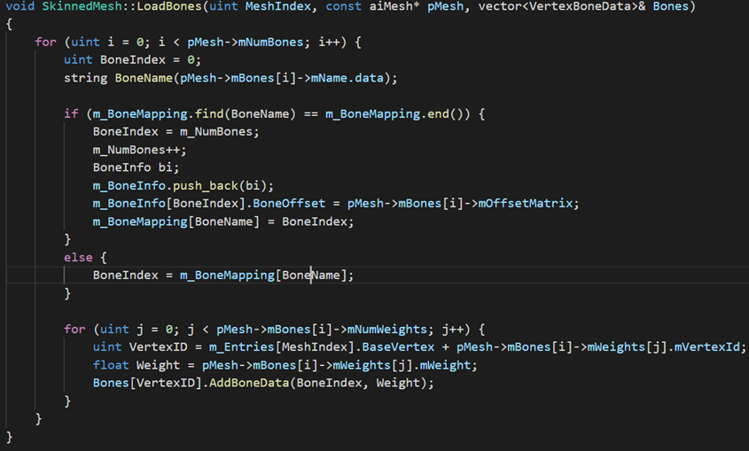
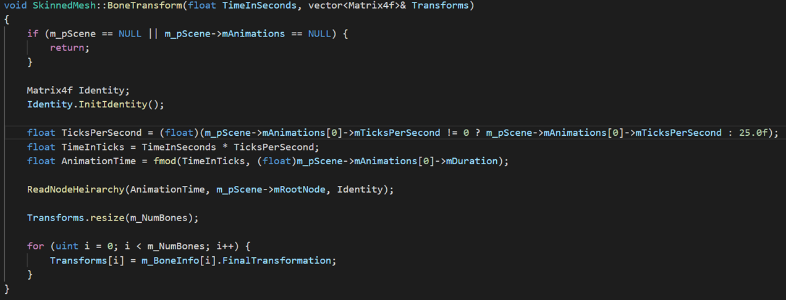
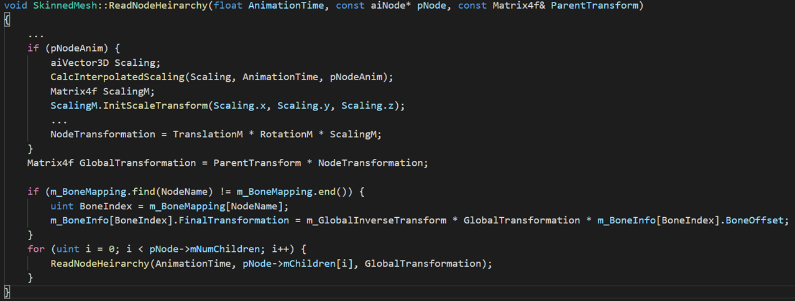
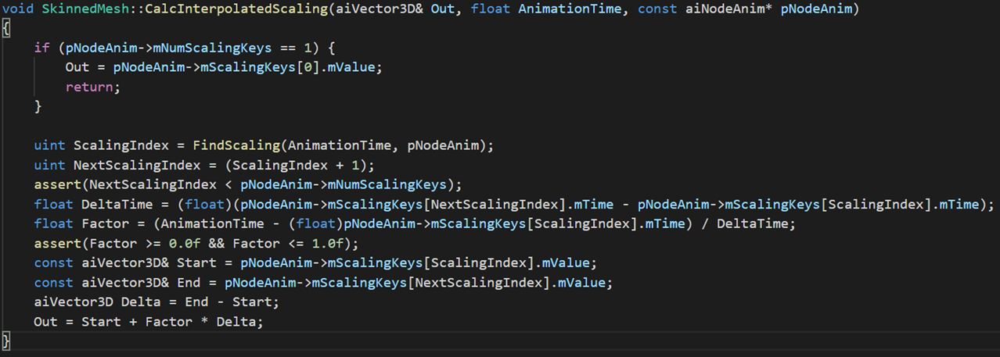

## 个人工作

- 纹理映射
- 模型导入
- 骨骼动画。

由于整个项目是建立在LearnOpenGL上面的，所以纹理映射和模型导入的功能已经提供了，这些功能不再赘述了，主要说明骨骼动画的工作。

## 骨骼动画

### 寻找模型

这部分占用的时间是比较多的，大概占到60%的时间，因为涉及到静态物体和动态物体，所以需要分开寻找。静态物体主要找的是obj文件，obj文件是可以直接打开的方便调试，和mtl文件关联，这是比较容易的。但是水下资源是很少的，路上资源随便找，这也是为什么没有时间去做多余的功能的原因，因为这部分是在是太耗时间了，比如珊瑚礁，海带，海草这些，网上全部找不到，即使找到了也不能用，所以最后只要那陆地上的资源，比如花草树这些。动态资源就更难找了，主要使用的是fbx文件，由于是海底，所以一般会锁定鱼，水蛇，海龟，水母这些，最后也是没有找到，唯一一个找到的是鲸鱼。后来在Unity Asset store里面找，最后可以用的有兽人，蜜蜂，鸟人，最后就选择了鸟人。

### 软件处理部分

对于我而言，把模型导入到OpenGL中，分两步。第一：直接把模型导入到OpenGL中，看看有没有报错或者异常显示，如果有异常就转到第二步：把模型导入到blender当中，看看是否能够正常显示，如果可以再利用blender把文件重新导入，再利用新的文件试试能不能正常运行。一般obj文件出问题，有这几种：第一：没有报错，但是在场景中看不到。第二：运行时直接报错。第三：缺少贴图。FBX出问题有如下几种：第一：没有动作会直接报错。第二：文件路径有问题。第三：乱码。第四：文件版本过早。第五：缺少贴图。只解决缺少贴图的问题，其他问题不予解决。但是贴图也会出问题，有会情况在blender中预览的结果与实际导入到OpenGL中的模型不一致，比如鲸鱼模型，贴图是上下颠倒的，在blender里面反向贴图，在OpenGL里面才会显示正常。

另外，虽然自己也在blender里面为鱼做了骨骼动画，正如期中文档一样，一条鱼三个骨骼，然后设置动画，但是导入到OpenGL中，虽然没有报错，但是看不到模型，所以就放弃了自己动手做骨骼动画，全部由网上模型导入。

### 代码部分

主要参考[教程](http://ogldev.atspace.co.uk/www/tutorial38/tutorial38.html),里面有自带的模型，是已经可以运行的，课堂上许多展示的骨骼动画都是自带的模型，比如绕着海滩跑的人物模型，还有提着灯笼的守卫。但实际上用该网站的代码，不需要自己做代码的处理就可以运行起来了，但是这部分代码过于老旧，所以为了配合LearnOpenGL的代码，就需要自己做整合。这部分主要的难点在于，在整合好代码之前，都不知道结果，因为输入是一个fbx模型，输出就是一个骨骼动画，中间是没有产出可以看的，所以要理解整个过程，才可以整合的好。

#### 顶点着色器的改动
骨头的IDs是一个骨头变换数组的索引.主要目的是得到BoneIDs和Weights,暂时只考虑最多四根骨头的情况,少于四根骨头也可以兼容.

#### 读取部分
通过文件路径读取得到m_pScene将mTransformation本地储存，并且求逆

导入mesh以及material

Position,Normals,TexCoords直接导入
Bones，单独导入

骨头ID和骨头名字对应关系
将骨头ID和权重储存在vector里面

#### 调用部分
指定时间，所用的animation，读取矩阵变换

得到变换的步骤，缩放，旋转，平移整合，得到最终的 FinalTransformation

以scale为例，线性插值的过程

