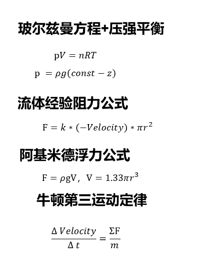

# 计算机图形学期末项目个人报告

| 学号     | 姓名 | githubID                   |
| -------- | ---- | ---------------------- |
| 16340294 | 朱逸渠 | kotomineshiki |

## 水体模拟：Gesner波实现水体的波动

一般来说水体模拟技术包括贴图、光学效果（折射衍射漫反射）、mesh animation、法相贴图四种方法。

这一部分一开始是想做带折射和全反射的光学水面的，但后来意识到上方的水面是由天空盒完成的，加上本身技术有限，所以水体模拟仅使用了mesh变形+贴图的方案。

### 遇到的困难：数据从内存传入显存后就无法直接用代码控制

解决方案，修改Model 和mesh类的初始化方法，使得每一帧重新传入数据并绘制。这个方案并不理想，因为CPU和显卡之间的IO开销非常大（虽然在本次作业中由于网格规模不大而可以接受）

### 基于正弦波叠加的基本模拟

下列
```
	void Update() {//根据时间来变换波函数的节点
		//std::cout << currentlandscape.meshes.size() <<"____________________"<< endl;
		float time = glfwGetTime();
		for (int i = 0; i < currentlandscape.meshes[0].vertices.size(); ++i) {//每14个一周期
			glm::vec3 calculatePosition = landscape.meshes[0].vertices[i].Position;

			calculatePosition = Gerstner(calculatePosition, time);
			//calculatePosition.y += 0.3 * cos(1 * time - calculatePosition.x) + 0.15 * cos(2 * time - 2 * calculatePosition.x) + 0.1 * cos(4 * time - 3 * calculatePosition.x);//波动方程
			currentlandscape.meshes[0].vertices[i].Position = calculatePosition;
		}//这个是mesh数据
	//	std::cout << currentlandscape.meshes[0].vertices[0].Position.x << currentlandscape.meshes[0].vertices[0].Position.y << currentlandscape.meshes[0].vertices[0].Position.z << std::endl;
	}
```

### 基于Geszer波的海水模拟
G波是目前比较主流的水面模拟方法。对于每一个水立方，不止有y方向的简谐运动，还具有xz平面内的运动。很多个运动叠加就可以得到比较真实的水面效果。此处用gerstner来代替之前正弦波的计算表达式。
```
	glm::vec3 Gerstner(glm::vec3 input,float time) {
		const int n = 3;  // 频率划分个数
		const int m = 2; // 方向的划分个数
		double thetas[m] = { 0.38,1.42 };  // 传播方向
		double amplitudes[n][m] = {  //波幅
			0.2,0.2,
			0.3,0.50,
			0.2,0.6,
		};
		double omegas[n] = { 3.27,3.31,3.42 };     //  角频率
		double waveNums[n] = { 1.091,1.118,1.1935 };  // 波数
		float x = input.x;
		float y = input.y;
		float z = input.z;
		for (int i = 0; i < n; i++) {
			for (int j = 0; j < m; j++) {
				x -= 0.2*cos(thetas[j])*amplitudes[i][j] * sin(waveNums[i] * (x*cos(thetas[j]) + z * sin(thetas[j])) - omegas[i] * time);
				y += 0.1* amplitudes[i][j] * cos(waveNums[i] * (x*cos(thetas[j]) + z * sin(thetas[j])) - omegas[i] * time);
				z -= 0.2*sin(thetas[j])*amplitudes[i][j] * sin(waveNums[i] * (x*cos(thetas[j]) + z * sin(thetas[j])) - omegas[i] * time);
			}
		}     return glm::vec3 (x, y, z);
	}

```


### 优化：使用blender的合并面来削减面片数量

虽然到此效果已经不错了，但是帧率不高，只有两三帧一秒。所以需要在blender建模软件中把面片数量消减，提高帧率。

## 粒子系统：物理动力学公式和唯象性公式结合

### 粒子效果框架
粒子系统：粒子系统控制着很多个独立粒子。每个粒子都有四个生命周期：初始化、动力学刷新、绘制到屏幕、死亡、重生。

在这个管线中，我们可以操作的是初始化和动力学刷新。我通过给粒子设计各种各样的初始化随机策略和动力学规则来实现各异的粒子效果。

``` c++

void ParticleGenerator::Update(GLfloat dt, Transform &object, GLuint newParticles,
	glm::vec3 offset)
{
	// Add new particles 
	for (GLuint i = 0; i < newParticles; ++i) {
		int unusedParticle = this->firstUnusedParticle();//找到第一个未使用的粒子位置
	//s	std::cout << unusedParticle <<"********"<< std::endl;
		if (unusedParticle == -1)break;//不需要处理
		this->respawnParticle(this->particles[unusedParticle], object, offset);
	}
	// Update all particles
	for (GLuint i = 0; i < this->amount; ++i)
	{
		Particle &p = this->particles[i];
		p.Life -= dt; // reduce life
		if (p.Life > 0.0f)
		{	// particle is alive, thus update
			GLfloat k = 1;//粘滞阻力系数
			glm::vec3 acce;
			if (type == 1) {
				acce = -p.Velocity*k*p.scale*p.scale + glm::vec3(0, 20, 0)*p.scale*p.scale*p.scale;//加速度=粘滞阻力+浮力
				p.scale = p.initialScale*1*pow(double(23 / (10 * (100.0 + p.Position.y*3))), 0.3333);//压强影响体积的方程，也就是说，气泡越靠近水面就越大
			}
			if (type == 2) {
				acce = -p.Velocity*k*p.scale*p.scale*(0.1f)*0.25f*0.5f + glm::vec3(0, -25, 0);
				p.scale = 6*sqrt(p.Life/15);
				p.Color = glm::vec4((p.Life/15)*(p.Life / 15), 0, 0, 1);
			}
			if (type == 3) {
				acce = glm::vec3(0, 0, 0);
			}

			p.Velocity += acce * dt;//动力学方程
			p.Position += p.Velocity * dt;


		//	p.Color.a -= dt * a_atten;
		//	std::cout << "life" << p.Life << " " << p.Velocity.x << " " << p.Velocity.y << " " << p.Velocity.z << std::endl;
		}
	}
}
```


``` c++
void ParticleGenerator::respawnParticle(Particle &particle, Transform &object,
	glm::vec3 offset)
{
	//随机产生一个粒子
	//-5到+5的随机数
	GLfloat random1 = ((rand() % 100) - 50) / 10.0f;
	GLfloat random2= ((rand() % 100) - 50) / 10.0f;
	GLfloat random3 = ((rand() % 100) - 50) / 10.0f;
	GLfloat random4 = ((rand() % 100) - 50) / 10.0f;
	GLfloat randomtime = ((rand() % 100) - 50) / 10.0f;
	//随机颜色
	GLfloat rColor1 = 0.5 + ((rand() % 100) / 100.0f);
	GLfloat rColor2 = -1.0 + ((rand() % 100) / 100.0f) * 2;
	GLfloat rColor3 = -1.0 + ((rand() % 100) / 100.0f) * 2;
//	particle.Position = object.Position + random + offset;
	if (type == 1) {
		particle.Life = life + randomtime;
		particle.Velocity = glm::vec3(random1 / 4, random2 / 4, random3 / 4);
		particle.Position = object.Position;
		particle.initialScale = 1 + random4 / 5;//使得初始的气泡大小错落不一
	}
	if (type == 2) {
		particle.Life = life + randomtime / 5;
		particle.Velocity = glm::vec3(random1*60, abs(random2 *60), random3 *60 )+object.Velocity;
		particle.Position = object.Position;
		particle.Color = glm::vec4(1, 0, 0, 0);
	}
	if (type == 3) {
		particle.Life = life+randomtime*3;
		particle.Velocity = glm::vec3(random1, random2, random3);
		particle.Position = glm::vec3(random1 * 200, random2 * 200, random3 * 200);
	}
}
```

### 带水阻、和气泡大小和压强关联的气泡模拟

我们先进行受力分析，气泡主要需要考虑力是

- 竖直向上的浮力
- 和速度方向相反的流体阻力

需要使用到的公式是：

- 阿基米德浮力公式
- 玻尔兹曼方程
- 流体阻力方程（经验近似）
- 牛顿第三运动定律
- 



初始化方案：

这样一来，就可以实现气泡快速扩散后达到稳恒后匀速上升，并且随着高度的增加，气泡的体积变大，并使得不同大小气泡的收敛速度是不一样的。

### 水下的火山岩浆喷发模拟

这是在海底喷射的岩浆，和陆地上的火山喷发比起来应该可以漂浮更久的时间，但是由于水阻力曲线应该比抛物线更加陡峭。另外一方面，考虑到水会快速冷却岩浆而使得岩浆从红色变成黑色，所以需要单独给颜色写一个变化公式和shader的变量。

岩浆需要考虑的规则是：
- 水阻力
- 重力
- 浮力

初始化：需要注意保证射出速度有朝上的分速度。

### 浮游生物

这一部分比较简单就可以取得比较理想的效果

初始化随机位置，并随机一个速度和一个比较长的生存时间。

## 其他工作

### 场景管理类